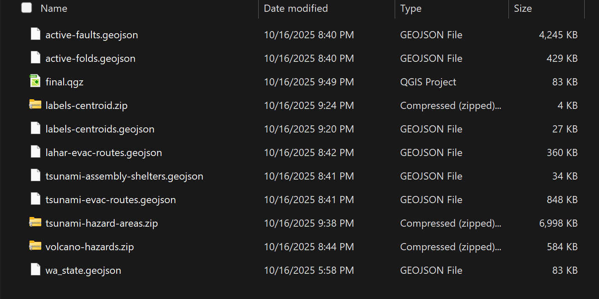
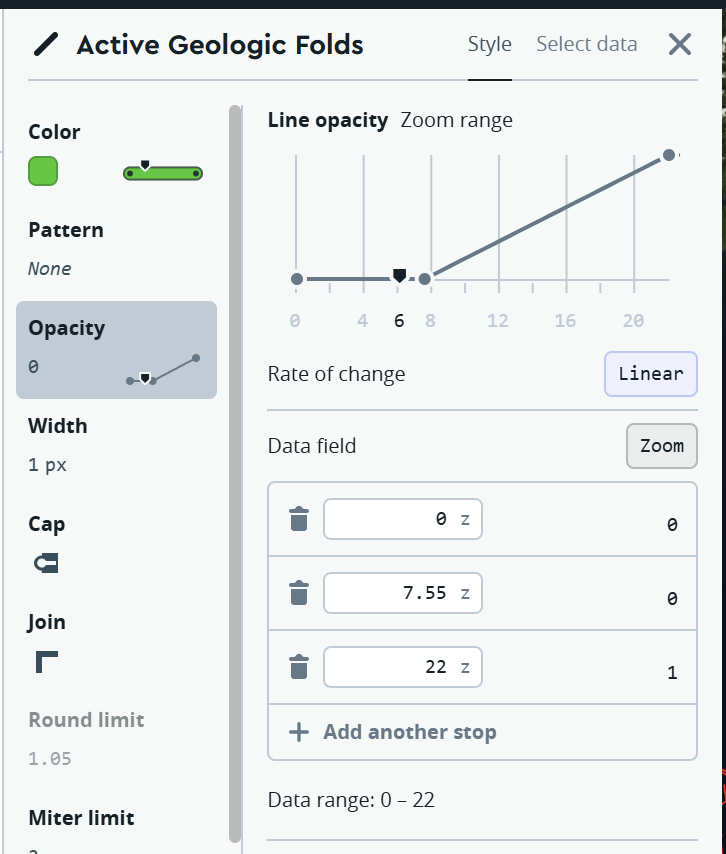
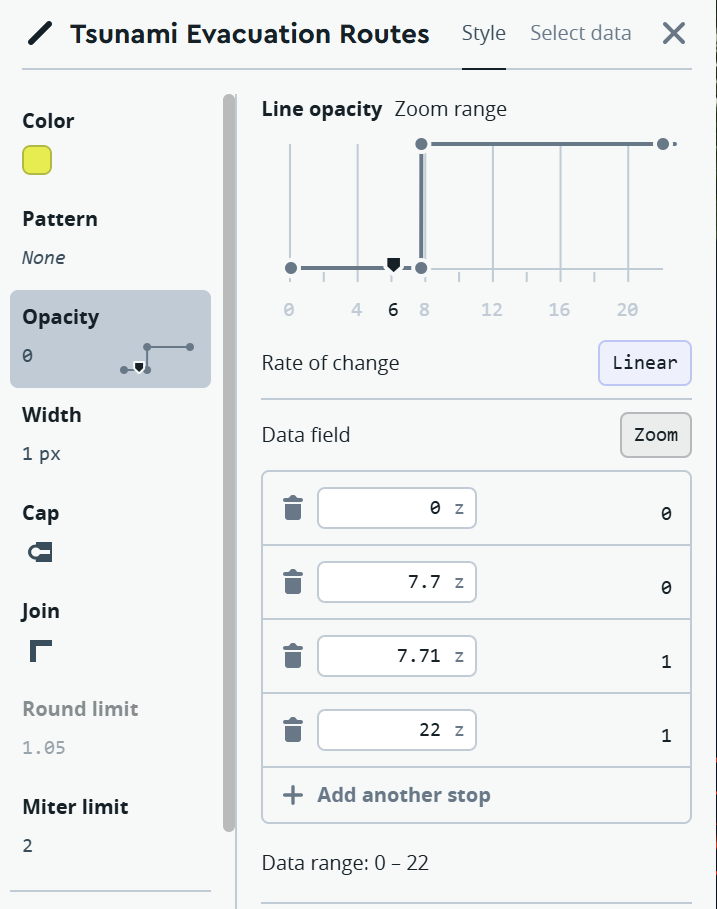
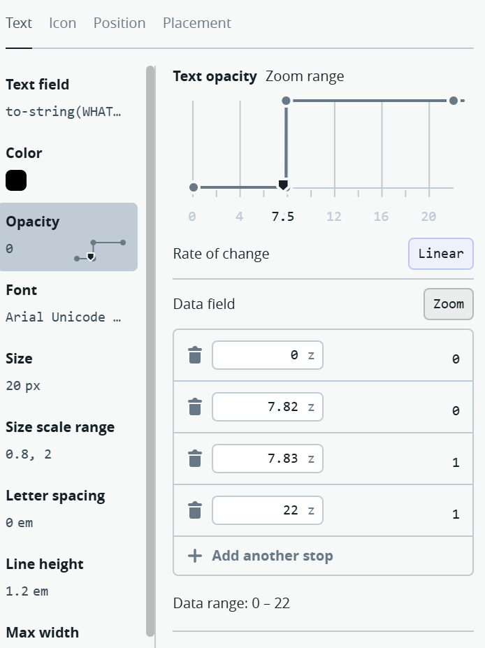
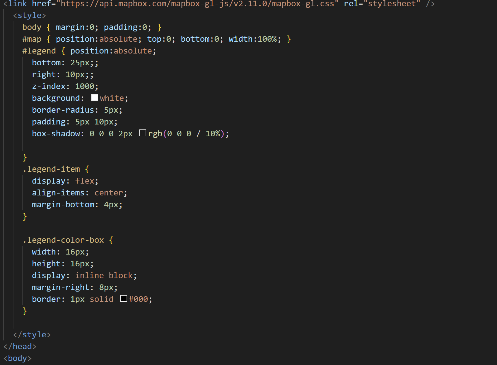
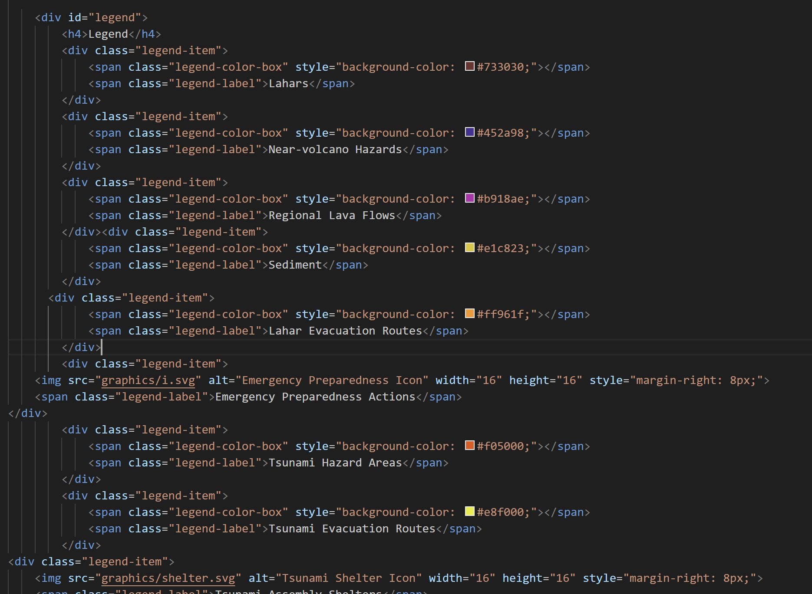

# Final Project: Interactive Washington State Hazards Map
I decided to utilize my local experience with Washington State Geology and the state's wealth of open data to create and interactive map depicting local natural hazards. The state is well known for its volcanoes, earthquakes, and tsunami hazards, and there is also a plethora of emergency preparedness plans in place which I decided to map here. 

The data is all publically accessible from the state's <a href="https://geo.wa.gov/">Open Data Portal</a>. The data itself is predominantly from the Department of Natural Resources, although the Lahar Evacuation Routes data comes explicity from Pierce County, as these routes are almost entirely within the county.

# Geoprocessing
I initially processed the data using QGIS 3.40.10. Most of the data was already formatted correctly, however there were many datasets that I had to cull as they provided little informational value. Specifically, there was an earthquake epicenters GeoJSON that contained points all across the state that I felt only served to fill up the map. There were also Tsunami and Volcano hazard polygons that covered nearly the entire state which I culled because I felt they were entirely unnecessary. 

   
*Initial data management on the local github repo*

Other than that, the majority of geoprocessing took place in mapbox, adjusting layers visually to scale-based rendering and colors, labels and symbols. Lastly, I added the legend via HTML because apparently mapbox does not provide a tool for this out of the box. 

   
*Adjusting layer visibility (visible only when zoomed out)*

   
*Adjusting layer visibility (visible only when zoomed out)*

   
*Adjusting text label visbility*

When it came to creating the legend, I had to do a fair amount of googling to figure this out. So I figured I would include screenshots to help if anybody else needs to do this with mapbox in the future. 

   
*Creating the legend via html*

   
*Creating the individual layer entries in html*

# index.html link

Use <a href="https://github.com/purcelldj/map-671-final-purcelldj/blob/main/index.html">this link</a> to reach the index.html file.
 
# Map projection

Some of the original geodata came in EPSG 4326 - WGS 84, but a small majority of the data came in the Washington South State Plane Coordinate System - EPSG 2927. Before I brought the data over to mapbox, I exported all of the data to either GeoJSON or Shapefiles using the EPSG 4326 projection to allow the data to be used by mapbox. 